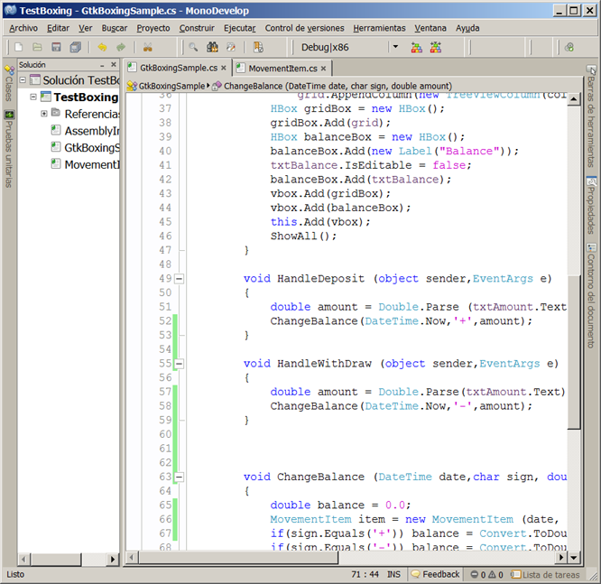
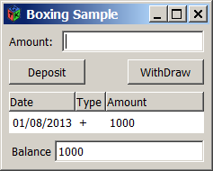
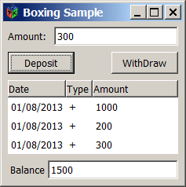
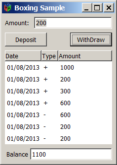

# Entendiendo Boxing en C#

Todos los tipos de datos en C# heredan de la clase base Object, tanto los tipos de datos por valor (ejem: primitivos) como los tipos por referencia (ejem:clases), esta herencia permite convertir un tipo de dato por valor a uno por referencia y a la inversa, a estas operaciones se les conoce como <b>Boxing</b> y <b>Unboxing.</b>

Estas operaciones son importantes dentro del sistema de tipos de C# ya que unifican la forma de trabajar con ellos, puesto que será posible invocar a métodos comunes en cada uno de ellos sin importar su tipo.

El siguiente programa GTK# muestra estos conceptos, el programa emula a un sencillo administrador de cuenta bancaria solicita una cantidad para depositoo retiro  y según el tipo de movimiento pone un signo de '+’ si es deposito y un signo de '-'si es retiro.

El programa consta de una estructura <i>MovementItem</i>  y de la clase <i>GtkBoxingSample.</i>

 

Al ejecutar el  programa se verá la siguiente ventana con un saldo inicial de 1000

 

Al ingresar un cantidad y dar click en el botón <i>"Deposit"</i>, se mostrará el movimiento con un signo "+" sumando el monto al saldo.

 

Lo mismo sucederá con el botón <i>"WithDraw"</i>, solo que se muestra el movimiento con un signo "-" restando el monto al saldo.

 

Se usan las técnicas de Boxing/Unboxing en el método <i>ChangeBalance</i> 

<b>Listado 3. Boxing/unboxing en C#.</b>
 

En .NET toda estructura o tipo simple es un tipo por valor y como la propiedad Text del Widget Entry admite únicamente el tipo String que es un tipo por referencia, por lo que para mostrar la cantidad en el campo de texto Balance, utilizamos el Boxing como en la siguiente línea:

<pre>
txtBalance.Text = Convert.ToString(balance); //boxing
</pre>

Después para agregar un item en el <i>ListStore</i> utilizamos el método <i>AppendValues()</i>, el cuál recibe como argumento un arreglo de objetos, nuevamente tenemos que utilizar el Boxing para cada que cada tipo simple de la estructura se convierta en un tipo por referencia, esto se hace con la siguiente línea:

<pre>
_store.AppendValues ( item.Date.ToString("dd/MM/yyyy"), //boxing date to string
Convert.ToString(item.Sign), //boxing char to string
item.Amount.ToString() ); //boxing double to string
</pre>

Internamente el proceso de Boxing lleva los siguientes pasos: 
<ol>
<li>Se reserva una cantidad de memoria adicional al tipo de variable para las operaciones adicionales que diferencian a aun objeto de un tipo simple.</li>
<li>Se crea una variable de objeto temporal en donde se almacenará el valor de la variable.</li>
<li>Se copia el valor de la variable al valor del objeto creado.</li>
<li>Se regresa la dirección del objeto ya que en este momento el tipo por valor es un tipo por referencia.</li>
</ol>

El <i>Boxing</i> puede ser llevado a cabo de forma implícita por ejemplo:

<pre>
item.Date.ToString("dd/MM/yyyy");
O de manera explícita, por ejemplo:
object objAmount = amount;
objAmount.ToString();
</pre>

El proceso de <i>Boxing</i> es costoso ya que requiere de una memoria adicional que afecta al performance de la aplicación, además ocasiona que el código IL producido sea mucho mayor.

